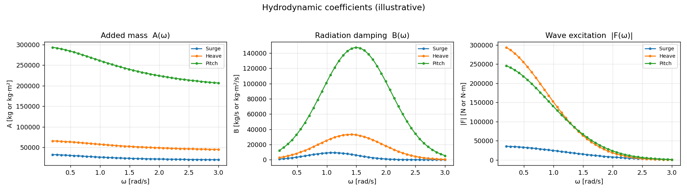

# NEMOH Hydrodynamic Coefficients — Boat Hull

Compute the **frequency-domain hydrodynamic coefficients** of a boat hull using
**[NEMOH](https://gitlab.com/lheea/Nemoh)** (the open-source Fortran BEM
potential-flow solver from LHEEA / École Centrale de Nantes, v3), orchestrated
end-to-end from Python.

```
boat geometry ─▶ panel mesh ─▶ Nemoh.cal input ─▶ NEMOH solve ─▶ coefficients ─▶ CSV + plots
                 (Python)        (Python)          (Fortran)       (Python)        (Python)
```

The **engine is NEMOH**. Python does everything around it: builds the mesh, writes
the `Nemoh.cal` control file, launches the NEMOH executable, and parses/plots the
output. This is the standard way to run NEMOH (it ships no official Python API).

## What it computes

For each requested degree of freedom (surge / heave / pitch by default; all 6 DOF
supported), over a user-defined frequency sweep:

- **Added mass** A(ω)
- **Radiation damping** B(ω)
- **Wave-excitation force** |F(ω)| (Froude–Krylov + diffraction)

Outputs land in `outputs/` as tidy CSVs (`added_mass.csv`, `radiation_damping.csv`,
`excitation_force.csv`, plus a combined `coefficients_all.csv`) and a summary figure
`hydrodynamic_coefficients.png`.



## Run it

```bash
pip install -r requirements.txt
python main.py
```

- **With a NEMOH binary** on PATH (or `NEMOH_BIN=/path/to/nemoh python main.py`):
  a real BEM solve.
- **Without it:** the script runs in **illustrative mode** — physically-shaped
  coefficient curves so you can see the exact outputs and file formats before
  compiling Fortran. (The figure above is illustrative mode.)

## Optional independent cross-check

[`Capytaine`](https://github.com/capytaine/capytaine) is a *separate*, Python-native
BEM solver in the same potential-flow family. It is **not** NEMOH — it is used only
to reproduce the same coefficients independently and sanity-check the NEMOH numbers:

```bash
pip install capytaine
python validate_capytaine.py
```

## For a real hull

Replace the demo box hull in `hull.py` with an import of the client's geometry
(STL / STEP / IGES / hull offsets) via `meshmagick` or `trimesh`, clip it at the
waterline, and verify displaced volume against the expected displacement. Everything
downstream (NEMOH solve, CSV, plots) is unchanged.

## Method note (honest scope)

NEMOH is **linear potential-flow** (inviscid, first-order). It gives added mass,
radiation damping, wave excitation, and RAOs accurately. It does **not** capture
viscous roll damping (roll needs an empirical correction on top) or slamming /
nonlinear effects. NEMOH v3 additionally supports second-order QTFs if needed.

## Files

| File | Role |
|------|------|
| `main.py` | pipeline entry point |
| `hull.py` | geometry → panel mesh (demo box hull; swap for client geometry) |
| `nemoh_driver.py` | write NEMOH mesh + `Nemoh.cal`, run solver, parse output |
| `postprocess.py` | CSV export + plotting |
| `validate_capytaine.py` | optional independent cross-check |

---
Dr. Sandeep Grover — scientific-computing & simulation pipelines in Python.
